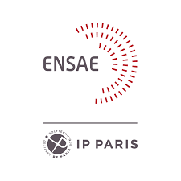

# Project Python 2023

Projet "Python pour la DataScience" en 2ème année cycle ingénieur à l'ENSAE. 

### Clinical Trials

Le but du projet est d'étudier l'impact de faits extra-médicaux sur le succès d'un essai clinique en phase 3.

Afin de comprendre le contexte derrière la problématique, le fichier ``documentation`` comporte une brève présentation des essais cliniques.

### Start
Depuis un terminal, effectuer les commandes suivantes :

1. Assurez-vous d'avoir Python installé.
2. Clonez ce dépôt (cf: [Guide pour cloner un dépot](https://docs.github.com/fr/repositories/creating-and-managing-repositories/cloning-a-repository)).
3. Accédez au répertoire du projet via le terminal.

Après avoir créé un environnement virtuel (cf: [Guide création environnement virtuel sur vs code](https://code.visualstudio.com/docs/python/environments)) installer les packages nécessaires avec:

```bash
pip install -r requirements.txt
```

### Récupération des données

Afin de scrapper des données cliniques, vous pouvez utiliser directement un terminal cmd en executant le code suivant:
```bash
python ./data/GetCliniData.py --size 20 --keyword france --path clini_data.csv
```

- [size]: Nombre de données à scrapper (en milliers)
- [keyword]: Mot clé pour la recherche de données
- [path]: chemin d'accès du fichier de sortie (sous format csv!) 

### Guide du Projet

Le projet est réparti en plusieurs. Afin de ne pas disposer d'un seul notebook très volumineux, chaque dossier présente une étape du projet. La partie analyse des données dans le dossier ``analyse des données`` montre une analyse primaire des données ainsi que quelques graphiques. Les dossier ``Durée Essai clinique`` et ``Succès Essai cliniques`` présente la partie modélisation. D'un côté on modélise la durée d'un essai clinique, de l'autre sa probabilité de succès Une brève revue de littérature est disponible dans le dossier ``Revue Littérature``.
Le dossier ``synthèse`` présente un résumé du projet par partie ainsi que nos résultats principaux

### Contributeurs

Nadia ZARGOUNI - nadia.zargouni@ensae.fr

Youssef EL HACHEM - youssef.elhachem@ensae.fr

Quentin MOAYEDPOUR - quentin.moayedpour@ensae.fr