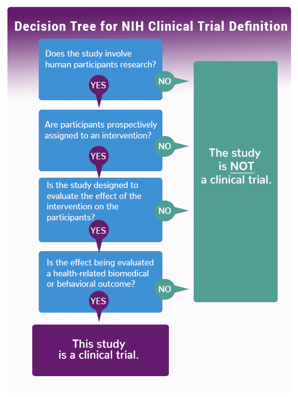

# Revue de littérature

Plusieurs études se sont consacrées aux déterminants de la réussite d'essais cliniques en phase III sans forcément souligner ce qui relève de la recherche médicale. En effet, un certain nombre de paramètres non médicaux, notamment les conditions dans lesquelles sont menés les essais cliniques (nombre de participants, protocole mis en place, choix d'indicateurs de performance de l'essai clinique, temporalité...) ou les acteurs engagés dans l'essai clinique (laboratoires ou universités de renom, zone géographique à forte intensité de recherche médicale, sponsors mobilisés...) ont un impact sur la survie d'un essai clinique par delà la phase III. 

En ce qui concerne le succès des essais cliniques, il existe une perception universelle selon laquelle l'enregistrement des patients est un facteur clé pour déterminer la réussite des essais cliniques. Une analyse des essais cliniques enregistrés comme clos en 2011 a révélé que 19 % des essais cliniques ont été interrompus en raison d'un nombre insuffisant de participants. Johnson (Johnson O. 2015) a noté qu'environ 80 % des essais cliniques ne parviennent pas à atteindre les objectifs initiaux en matière d'inscription et de délais, entraînant des pertes de 8 millions de dollars de revenus par jour pour les entreprises de découverte de médicaments. Dans les données examinées dans cette étude, parmi les essais cliniques qui ont été interrompus, de nombreux cas ont été identifiés comme ayant été interrompus en raison d'échecs dans l'inscription des patients. De plus, dans le cas des essais cliniques de phases 2 et 3, le nombre de patients nécessaires pour prouver la sécurité et l'efficacité d'un médicament augmente de 100 à 1000, ce qui fait de l'inscription des patients aux essais cliniques un facteur clé de succès.

La littérature a mis en lumière les effets positifs des facteurs suivants : 
- La présence d'un ou de plusieurs collaborateurs en plus de la cohorte de chercheurs
- La rapidité de l'essai clinique (en admettant qu'il est initié à partir de la participation du premier patient, à chaque phase, et qu'il est achevé à la fin de la récolte des données sur les patients)
- La qualité du sponsor de l'étude (expérience, taux de succès passé, poids financier)
- La concentration des sponsors et collaborateurs sur une même zone géographique
- La complexité du profil de patient recherché

Après avoir récupéré les données, on propose dans un premier temps une présentation et analyse primaire des données dans le dossier ``analyse des données``. Ensuite, on utilisera un modèle de NLP pour pouvoir quantifier la spécificité des profils recherchés. On estimera ensuite à l'aide de plusieurs modèles tel que les modèles de hazard ou une regression l'impact de nos variables d'intérêts sur la durée d'un essai clinique dans le dossier ``Modelisation``. Afin d'accompagner une interprétation à nos résultat, ces derniers sont présentés dans différents notebooks et les fonctions qu'on utilise sont généralement présentes dans des modules annexes pour alléger le contenu des notebooks.
  - l'analyse est principalement divisée en deux parties, une analyse de durée de vie des essais en phase III, et une régression sur le succès d'un essai clinique arrivé à la fin de sa phase III en fonction de paramètres extra médicaux.
  - Par ailleurs, il a été question de travailler sur les critères d'éligibilité des patients, et leur complexité relative, pour mesurer leur impact sur la durée de vie d'une étude. 

Nous nous concentrons donc sur un certain type d'étude médicale ici, l'essai clinique avec intervention et traitement, mené par des laboratoires (acteurs industriels). Comme nous travaillons sur les effets de la qualité des sponsors sur le taux de réussite des essais cliniques en phase III, les études ne précisant pas la localisation géographique des sponsors et des collaborateurs ont été écartées, de même que toutes les données comportant des erreurs détectées après la collecte sur ClinicalTrials.gov. Il est aussi important de noter que certaines données sont éronnées (par exemple, parfois la date de début n'est pas correcte).

En résumé les étapes principales de notre projet sont : 

1. Présentation des Essais Cliniques
Les essais cliniques sélectionnés pour l'analyse proviennent d'une base de données complète comprenant des informations détaillées sur plus de 8 300 essais. Chaque essai clinique est identifié par son numéro NCT, et la base de données contient des informations telles que le titre de l'étude, son statut, les conditions médicales étudiées, les interventions médicales appliquées, les dates de début et de fin, ainsi que la durée totale de l'essai.
2. Présentation des Enjeux
L'objectif principal de cette analyse est de comprendre les facteurs qui influent sur le succès ou l'échec des essais cliniques en phase III. Nous avons identifié les essais en cours (recrutement, actif mais non recrutant, non encore en recrutement, en cours d'invitation) et les avons exclu de notre modèle, nous concentrant sur les essais qui ont dépassé la phase III. L'enjeu majeur réside dans la capacité à prédire le résultat d'un essai clinique en fonction de diverses caractéristiques.
3. Présentation des Données
Le jeu de données comprend des informations diverses, notamment le statut de l'étude, les conditions médicales étudiées, les interventions médicales appliquées, les critères d'éligibilité, les dates de début et de fin, la durée de l'essai clinique, et d'autres informations pertinentes. 
4. Modélisation du Succès d'un Essai Clinique 
5. Modélisation de la Durée d'un Essai Clinique
Pour comprendre la durée d'un essai clinique, nous avons calculé la différence en jours entre la date de début et la date de fin de chaque essai.
