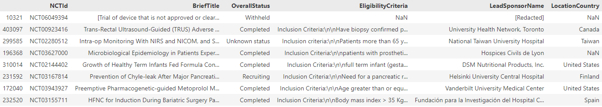
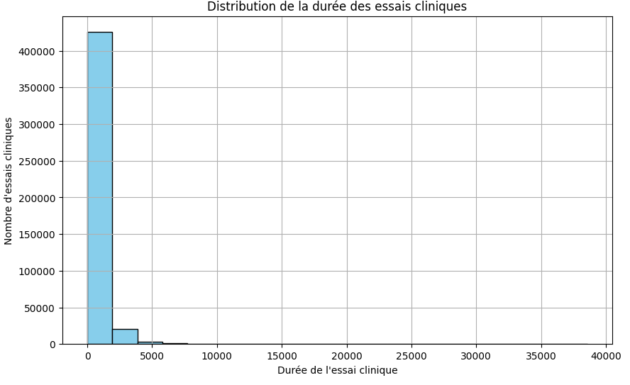
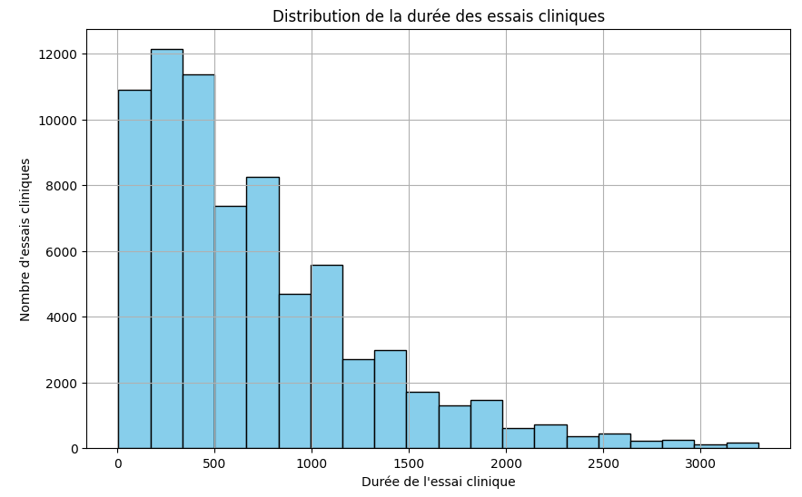
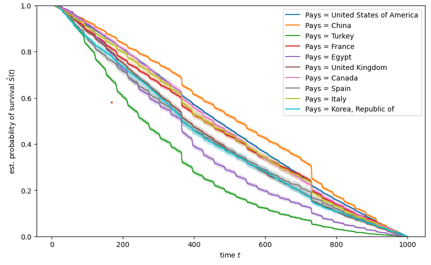
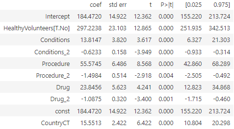

# **Durée et succès d'un essai clinique**

Quentin MOAYEDPOUR, Youssef EL HACHEM, Nadia ZARGOUNI.
ENSAE 2023/2024.

## Présentation du projet

Le but de ce projet est d'étudier différents facteurs qui jouent sur la durée ou le succès d'un essai clinique. Au cours du projet, on utilise des données d'essais cliniques du site [clinicaltrials](https://clinicaltrials.gov/), disponibles en libre accès, pour modéliser et interpréter l'impact de différents facteurs sur la réussite d'un essai clinique.

### Qu'est ce qu'un essai clinique

Un **essai clinique** est une étude de recherche menée chez des êtres humains pour évaluer l'efficacité et la sécurité d'une intervention médicale. Ces interventions peuvent inclure des médicaments, des procédures médicales, des dispositifs, ou d'autres approches médicales.

### Phases de l'Essai Clinique

Les essais cliniques sont généralement divisés en plusieurs phases, chacune visant à répondre à des questions spécifiques sur l'intervention étudiée.

#### Phase 1

- Objectif : Évaluer la sécurité de l'intervention.
- Participants : Un petit groupe de volontaires en bonne santé.
- Durée : Relativement courte.

#### Phase 2

- Objectif : Évaluer l'efficacité et identifier les effets secondaires.
- Participants : Un groupe plus important, souvent des personnes touchées par la maladie.
- Durée : Plus longue que la phase 1.

#### Phase 3

- Objectif : Confirmer l'efficacité, surveiller les effets secondaires à grande échelle.
- Participants : Un groupe encore plus important, représentatif de la population cible.
- Durée : Plusieurs années parfois.

### Phase 4

- Objectif : Surveillance continue après l'approbation réglementaire.
- Participants : La population générale.
- Durée : À long terme.

Chaque phase contribue à la compréhension globale de l'intervention médicale étudiée, de sa sécurité à son efficacité à grande échelle.

## Importance de la Phase 3 dans un Essai Clinique

La **Phase 3** d'un essai clinique revêt une importance particulière, notamment lors du processus d'obtention de l'autorisation des autorités de régulation, telle que l'AMF (Agence des Médicaments en France).

### Autorisation AMF

L'obtention de l'autorisation de l'AMF est un jalon critique dans le processus de développement d'un médicament ou d'une intervention médicale. Les données recueillies au cours de la Phase 3 sont cruciales pour persuader les autorités réglementaires de l'efficacité et de la sécurité de l'intervention.

### Difficultés Principales liées à la 3ème phase d'un essai clinique

#### 1. Durée

La Phase 3 est souvent la plus longue des phases, nécessitant plusieurs années pour collecter des données significatives sur l'efficacité à long terme et les effets secondaires.

#### 2. Coûts

La taille importante de l'échantillon et la durée prolongée de la phase contribuent aux coûts élevés associés à la réalisation de ces essais cliniques de grande envergure.

#### 3. Recrutement de patients

Coordonner un essai clinique à grande échelle, impliquant des centres de recherche multiples et divers participants, nécessite une logistique complexe et une gestion minutieuse.

Le recrutement de patients lors de la **Phase 3** d'un essai clinique revêt une importance cruciale pour plusieurs raisons majeures.

* **Représentativité de l'Échantillon**

La Phase 3 implique souvent un grand nombre de participants afin d'obtenir des résultats statistiquement significatifs. Un recrutement adéquat garantit que l'échantillon est représentatif de la population cible, assurant ainsi la validité externe des résultats.

* **Évaluation de l'Efficacité à Grande Échelle**

L'efficacité d'une intervention médicale doit être évaluée à grande échelle pour déterminer son impact réel sur une population diversifiée. Un recrutement insuffisant peut compromettre la capacité de généraliser les résultats.

* **Détection des Effets Secondaires Rares**

Certaines interventions médicales peuvent avoir des effets secondaires rares qui ne deviennent évidents qu'avec une grande cohorte de patients. Un recrutement robuste permet d'identifier ces effets secondaires rares mais potentiellement graves.

## Notre objectif

Le cadre étant présenté, notre objectif est d'étudier différentes variables qui influent sur la durée et le succès d'un essai clinique.

On dispose de données de la forme suivante:

On a **450 000** donnnées pour **328** variables. On utilise en réalité peu de variables au cours de notre projet.

### 1. Récupération des données

Pour récupérer les données, on a utiliser l'api de (clinicaltrials)[https://classic.clinicaltrials.gov/api/gui/demo/simple_study_fields]. L'api propose de récupérer les données de 1000 essais cliniques à la fois pour 20 variables. On a donc créer une fonction qui parcours pour un échantillon de 1000 essais cliniques 17 pages pour récupérer les 1000 variables en fusionnant horizontalement les dataframes. On réitère cette opération pour un autre échantillon de 1000 essais cliniques et on fusionne verticalement les dataframes. La fonction peut donc prendre du temps mais on a parraléliser la fonction pour diminuer le temps que met la recolte de données.

### 2. Analyse et traitement des données

On dispose maintenant d'un jeu de données, la première étape est de créer nos variables d'intérêts: la durée d'un essai clinique et son succès. On crée la variable ``TimePassed`` qui dénombre la durée, en jours, de l'essai clinique. On obtient une distribution de la forme suivante:

On comprends donc qu'on doit restreindre notre analyse à un sous échantillon car certains essais cliniques disposent d'une durée particulièrement élevé. On restreint donc notre analyse aux essais cliniques ayant durés moins de 3300 jours.

On a ensuite effectué une analyse préliminaire des données en traçant la courbe de survie de différents groupes

Les courbes représentent la probabilité qu'un essai clinique se termine à un moment t. L'estimation est non paramétrique mais permet d'avoir une idée de l'impact de différentes variables sur la durée de l'essai clinique.

### 3. Modéliser la durée d'un essai clinique

Afin de modéliser la durée d'un essai clinique, on veut voir si la complexité du profil de patient recherché influe sur la durée de l'essai clinique. Il n'y a pas de variable qui indique la complexité du profil de patient recherché, on a donc entraîné un modèle de Reconnaissance d'Entités Nommées (NER) qu'on applique ensuite aux textes présentant les critères d'éligibilités d'un essais cliniques. Le but est de pouvoir compter les attributs du patient type pour un essai clinique. Par exemple on peut dénombrer 4 procédures, 2 critères de conditions (maladies par exemples), 3 critères relatifs à un médicament prit etc... On utilise les données CHIA annotés pour entraîner un modèle BERT et on obtient les résultats suivants:

|      Label      | Precision | Recall | F1-Score | Support |
|-----------------|-----------|--------|----------|---------|
| B-Condition     |   0.84    |  0.82  |   0.83   |  2038   |
| B-Drug          |   0.88    |  0.81  |   0.84   |   774   |
| B-Mood          |   0.47    |  0.21  |   0.30   |    42   |
| B-Observation   |   0.54    |  0.28  |   0.37   |   211   |
| B-Person        |   0.82    |  0.74  |   0.78   |   172   |
| B-Procedure     |   0.70    |  0.73  |   0.71   |   590   |
| I-Condition     |   0.77    |  0.76  |   0.76   |  1588   |
| I-Drug          |   0.73    |  0.73  |   0.73   |   358   |
| I-Mood          |   0.64    |  0.27  |   0.38   |    26   |
| I-Observation   |   0.38    |  0.11  |   0.17   |   249   |
| I-Person        |   0.00    |  0.00  |   0.00   |    27   |
| I-Procedure     |   0.70    |  0.69  |   0.69   |   531   |
| O               |   0.91    |  0.94  |   0.93   | 12545   |

|    Metric       |   Value   |
|-----------------|-----------|
| Accuracy        |   0.87    |
| Macro Avg       |   0.64    |
| Weighted Avg    |   0.86    |

On applique ensuite le modèle pour compter attributs des critères d'éligibilités des essais cliniques dans le fichier ``Notebook_Conversion``. 

On utilise ensuite deux modèles, une regression linéaire et une régression cox pour évaluer l'impact de certaines variables sur la durée d'un essai clinique.

Résultat régression linéaire:

Résultats régression cox:

| Variable                | Coef    | Exp(Coef) | Exp(Coef) Lower 95% | Exp(Coef) Upper 95% | z      | p        |
|-------------------------|---------|-----------|---------------------|---------------------|--------|----------|
| Conditions              | -0.026  | 0.974     | 0.963               | 0.986               | -4.282 | <0.0005  |
| Conditions_2            | 0.001   | 1.001     | 1.001               | 1.002               | 5.774  | <0.0005  |
| Procedure               | -0.042  | 0.959     | 0.936               | 0.982               | -3.436 | 0.001    |
| Procedure_2             | 0.002   | 1.002     | 0.999               | 1.004               | 1.383  | 0.167    |
| Drug                    | -0.050  | 0.951     | 0.932               | 0.970               | -4.906 | <0.0005  |
| Drug_2                  | 0.002   | 1.002     | 1.001               | 1.003               | 3.595  | <0.0005  |
| CountryCT               | -0.017  | 0.983     | 0.976               | 0.990               | -4.845 | <0.0005  |
| HealthyVolunteers_No    | -0.350  | 0.705     | 0.660               | 0.753               | -10.383| <0.0005  |
| Gender_Female           | -0.135  | 0.874     | 0.797               | 0.958               | -2.877 | 0.004    |
| Gender_Male             | -0.045  | 0.956     | 0.804               | 1.137               | -0.506 | 0.613    |

##### Note: les variable "_2" représente le carré de la variable et "CountryCT" représente le logarithme du nombre d'essais cliniques réalisés dans le pays pour un essai clinique i.

Interprétation des coefficients: Chaque coefficient estimé s'interprète de la manière suivante. Le fait d'augmenter d'une unité de la ``variable_j`` multiplie, en moyenne et toute chose égale par ailleurs, le risque instantané de sortie de exp(beta_i). Si le coefficient estimé beta_i est négatif, cela signifie que la variable à un impact négatif sur le risque de sortie instantané.

On obtiens comme résultat que le type de sponsor d'un essai clinique n'a pas d'impact significatif sur la durée d'un essai clinique (dans les deux modèles étudiés). Un autre résultat surprenant est que lorsque l'on prends en compte le nombre d'essais clinique réalisé dans le pays pour chaque essais cliniques, on voit que ce dernier à un impact positif sur la durée de l'essai clinique. On s'attendait plutôt à ce que effectuer un essai clinique dans un pays qui en réalise plein diminuerait sa durée (en raison du partage de connaissances, meilleur développement des infrastructures etc...) mais on a observé le phénomène inverse. On note que ce résultat peut être du à un problème de biais et qu'il pourrait être intéressant de trouver des variables instrumentales potentielles pour estimer sans biais (s'il y en a un).

On remarque cependant que nos variables crées ont bien un impact significatifs. Selon nos modèles, un trop grand nombre de conditions sur le profils de patients recherchés tends à augmenter l'espérance de la durée d'un essai clinique. Le fait d'accepter des patients en bonne santé a aussi pour effet de diminuer la durée d'un essai clinique selon les modèles.

Les estimations n'ont cependant pas pris en compte si l'essai clinique était validé ou non. Un essai clinique peut terminer prématurément pour différentes raisons: n'a pas été validé par l'AMF, annulé etc... On se concentre maintenant dans une seconde partie à regarder l'impact de différents facteurs sur la probabilité de réussite d'un essai clinique

### 4. Modéliser le succès d'un essai clinique

Dans cette partie, on se concentre sur les déterminants du succès d'un essai clinique. On sépare dans un premier temps les essais cliniques en cours et ceux terminés et on ne se concentre que sur les essais cliniques en phase 3.

On remarque dans un premier temps que le sujet d'un essai clinique semble être un déterminant de son succès. En s'intéressant aux conditions que traitent un essai cliniques, on remarque que les essais cliniques qui portent sur les conditions les plus traitées ont une plus grande chance de réussite. 

Si dans une première partie on a vu que le type de sponsor influait peu sur la durée d'un essai clinique, ici on regarde aussi la réputation du sponsor.

En effectuant une regression logistique de la probabilité de succès sur différentes variables explicatives, on obtient les résultats suivants : 

| Variable               | Coefficient | Écart-type | Valeur z | P-value | Intervalle de confiance (95%) |
|------------------------|-------------|------------|----------|---------|--------------------------------|
| const                  | 1.6891      | 0.097      | 17.369   | 0.000   | [1.498, 1.880]                 |
| public                 | -0.1639     | 0.087      | -1.890   | 0.059   | [-0.334, 0.006]               |
| Eligibility_Criteria   | -0.0326     | 0.009      | -3.666   | 0.000   | [-0.050, -0.015]              |
| pop_subject            | 0.2169      | 0.071      | 3.036    | 0.002   | [0.077, 0.357]                |
| TimePassed             | 0.0002      | 0.000      | 1.093    | 0.275   | [-0.000, 0.000]               |
| nb_locations           | -0.0021     | 0.001      | -3.352   | 0.001   | [-0.003, -0.001]              |
| Placebo                | -0.2670     | 0.072      | -3.706   | 0.000   | [-0.408, -0.126]              |

où:
* public est une variable binaire qui prends la valeur de 1 si le sponsor est un sponsor publique, 0 sinon
* Eligibilit_Criteria dénombre le nombre de conditions spécifiés dans le texte de critère d'éligibilités
* pop_subject indique le nombre d'occurences d'un nom de maladie qui fait partie de la liste des maladies qui font l'objet du plus grand nombre d'essais cliniques. Parmi ces maladies, le coronavirus, le cancer, le diabete (diabetes mellitus en latin), SIDA, des maladies mentales telles que la dépression ou la schizophrénie.
* TimePassed est la durée de l'essai clinique : d'après notre revue de littérature, la durée d'un essai clinique est plutôt un frein au succès. 
* nb_location dénombre le nombre de centres différents où l'essai clinique opère
* Placebo est une variable binaire qui prend la valeur de 1 si l'essai clinique a utilisé un placebo

Ici la regression logistique nous permet d'interpréter que les signes et la significativité des coefficients. On remarque que la variable Eligibility_Criteria a un impact négatif sur la probabilité de succès d'un essai clinique. La durée d'un essai clinique n'a, selon le modèle, pas d'impact significatif sur sa probabilité de succès. Enfin quelques résultats sont intéressants et nécessitent une plus grande discussion autour de la méthode et de la possible présence de biais.

### 5. Conclusion

En modélisant la durée et le succès d'un essai clinique, on obtient les résultats principaux suivants:
* Un trop grand nombre de critère dans le profil du patient type tends à augmentée la durée d'un essai clinique, et diminuer sa probabilité de succès.
* Le type de sponsor ne semble pas avoir d'effet significatifs, que ce soit sur la durée ou sur le succès d'un essai clinique. Mais c'est la réputation du sponsor qui a un impact.
* Le sujet d'un essai clinique influe sur sa probabilité de succès. Plus particulièrement, plus un sujet est populaire dans le domaine clinique, plus sa probabilité de succès est élevée. 

Ces résultats confirment des points de vues importants de la littérature: 
Par exemple, certains projets comme le projet [OMOP-CDM](https://documentation-snds.health-data-hub.fr/snds/glossaire/omop.html) cherchent à standardisé les données cliniques afin de faciliter la recherche de patient pour un essai clinique. On a vu dans notre projet que un protocole clinique trop détaillé et trop complexe avait un effet néfaste sur la durée et le succès d'un essai clinique. 
